# ETIG-Stack InfluxDB3

## Introduction

I started this project out of frustration.  
As an IoT Solution Architect I deal a lot with data and visualization. Tons of sensors in tons of different projects require different (clean) sets of infrastructure components like InfluxDB and Grafana environments. And for **every** project I had to start over and repeat the deployment and configuration of the various components.

Then I stumbled upon a project by [Suyash Joshi](https://github.com/sjoshi) in the Influx Community area of GitHub: [TIG-Stack using InfluxDB 3](https://github.com/InfluxCommunity/TIG-Stack-using-InfluxDB-3).  
I used his work as a starting point to build a completely — well, as much as possible — automated deployment of a fresh Docker Extended TIG environment.

The components of this project are:

- **InfluxDB 3 (Core)** – Time-series database for metrics and IoT data  
- **Grafana** – Visualization and dashboarding platform  
- **Telegraf** – Data collection agent  
- **InfluxDB Explorer** – Web-based data explorer for InfluxDB  
- **NGINX** – Reverse proxy to publish the portals

With this stack I aim to reduce setup time from hours (or days) down to minutes — enabling anyone to spin up a clean, ready-to-use data environment for prototyping, testing, or demos.

---

## ⚡ Quick Start

If you just want to spin up a working stack right away (**No guts, no glory**):

```bash
# 1. Clone the repo
git clone https://github.com/EdwardVoermans/ETIG-Stack-InfluxDB3.git
cd ETIG-Stack-InfluxDB3

# 2. Make the setup script executable
chmod +x dev-setup-etig.sh

# 3. (Optional) Adjust environment variables in the script
vim dev-setup-etig.sh

# 4. Generate configuration and .env
./dev-setup-etig.sh

# 5. Start the stack
docker compose up -d
```

Then visit:

- **Grafana:** https://tig-grafana.tig-influx.test 
- **InfluxDB Explorer:** https://tig-explorer.tig-influx.test

Add to your `/etc/hosts` (or local DNS server) if needed:

```
127.0.0.1 tig-influx.test 
```

That’s it — you now have a full InfluxDB 3 + Grafana + Telegraf environment up and running.  
For more details, follow the complete guide below 👇

---

## Table of Contents

1. [Overview](#overview)
2. [Architecture](#architecture)
3. [Prerequisites](#prerequisites)
4. [Clone the Repository](#clone-the-repository)
5. [Configuration](#configuration)
6. [Run the Setup Script](#run-the-setup-script)
7. [Start the Stack](#start-the-stack)
8. [Access the Portals](#access-the-portals)
9. [Explore the Components](#explore-the-components)
10. [Customization](#customization)
11. [Production Considerations](#production-considerations)
12. [Troubleshooting](#troubleshooting)
13. [Directory Structure](#directory-structure)
14. [Credits and License](#credits-and-license)

---

## Overview

**ETIG-Stack InfluxDB3** provides an automated Docker-based setup for a complete IoT-ready data infrastructure.  
It eliminates repetitive manual steps by provisioning and wiring all required components with sensible defaults and optional self-signed certificates.

This environment is ideal for:
- Prototyping IoT and sensor data projects  
- Evaluating InfluxDB 3 Core and Grafana together  
- Demonstrating end-to-end telemetry pipelines  
- Rapid development of dashboards before production rollout  

---

## Architecture

```
Internet/External Sensors
         │
         ▼
┌────────────────────────────────────────────────────┐
│         frontend-network (172.20.0.0/16)           │
│  ┌─────────────┐              ┌──────────────────┐ │
│  │    Nginx    │◄─────────────┤    Telegraf      │ │
│  │   (Proxy)   │              │  (Collector)     │ │
│  └─────────────┘              └──────────────────┘ │
└────────────────────────────────────────────────────┘
         │                                  │
         │                                  │
         ▼                                  ▼
┌────────────────────────────────────────────────────┐
│         monitoring-network (172.21.0.0/16)         │
│  ┌─────────────┐  ┌──────────────┐  ┌────────────┐ │
│  │    Nginx    │  │   Grafana    │  │ InfluxDB3  │ │
│  │   (Proxy)   │─▶│ (Dashboard)  │─▶│ (Database) │ │
│  └─────────────┘  └──────────────┘  └────────────┘ │
│                                         ▲          │
│  ┌──────────────────┐  ┌────────────────┘          │
│  │InfluxDB-Explorer │  │                           │
│  │  (Web UI)        │  │                           │
│  └──────────────────┘  │                           │
│                        │                           │
│  ┌──────────────────┐  │   ┌──────────────────┐    │
│  │   Telegraf       │──┘   │ docker-socket-   │    │
│  │  (Collector)     │      │     proxy        │    │
│  └──────────────────┘      └──────────────────┘    │
└────────────────────────────────────────────────────┘
```
---

## Prerequisites

Before starting, make sure you have:

- **Docker** & **Docker Compose** installed.  
- **OpenSSL** (for certificate generation).  
- A **bash shell** or compatible terminal.  
- A machine or VM with preferably **2 CPU / 4 GB RAM** However I used a Raspberry Pi 4, works fine.
- Internet connectivity for pulling container images.

---

## Clone the Repository

```bash
git clone https://github.com/EdwardVoermans/ETIG-Stack-InfluxDB3.git
cd ETIG-Stack-InfluxDB3
```

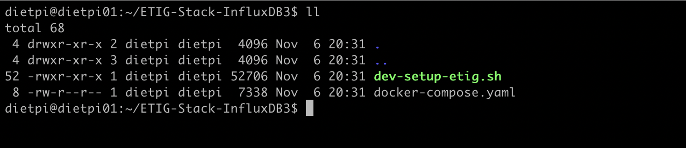

---

## Configuration

All environment variables are **generated automatically** by the setup script.  
You **do not** need to manually create or copy a `.env` file.

If you want to customize the default values (e.g., domain name, organization name, credentials, or certificate settings), open and modify the following script before running it:

```
vim dev-setup-etig.sh
```

You’ll find a section (#### First step, set VARs #####) inside the script with variables such as:

```bash
    ##### General
    export TLD_DOMAIN=tig-influx.test
    ##### NGINX Configuration
    export NGINX_HOST=tig-nginx
    export URL_GRAFANA=tig-grafana.tig-influx.test
    export URL_INFLUXDB_EXPLORER=tig-explorer.tig-influx.test
    export CERT_CRT=tig-influx.test.crt
    export CERT_KEY=tig-influx.test.key
```
Adjust these to match your environment or project requirements.
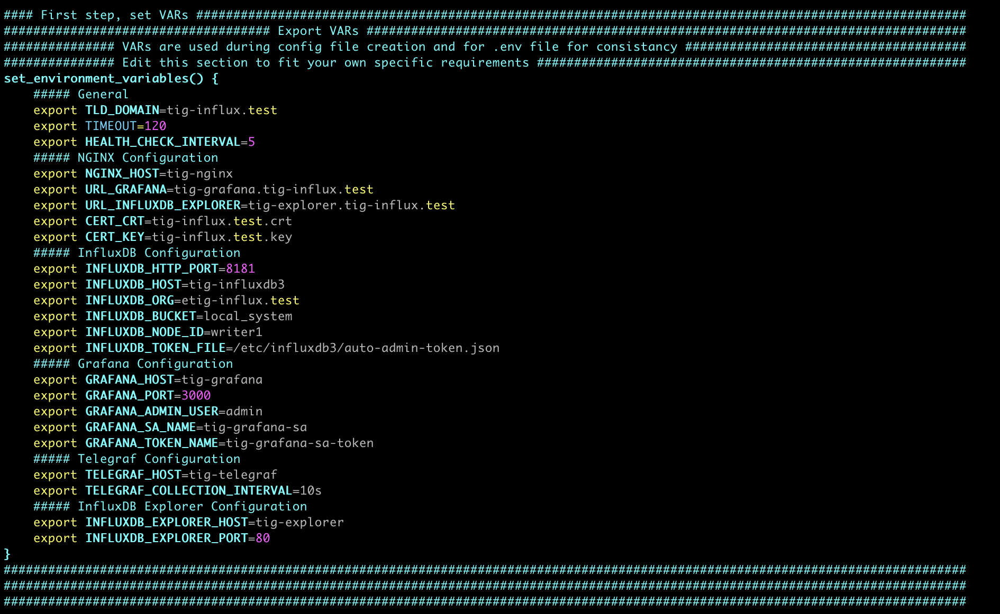

> 💡 The script will generate a `.env` file automatically based on these settings, which Docker Compose uses for the actual deployment.

---

## Run the Setup Script

Make sure the setup script is executable:

```bash
chmod +x dev-setup-etig.sh
```

Then run:

```bash
./dev-setup-etig.sh
```

This script will:

- Create required directories (`data`, `config`, `certs`, etc.)
- Generate TLS certificates (self-signed)
- Create secure credentials
- Generate the `.env` file
- Prepare Docker Compose configuration


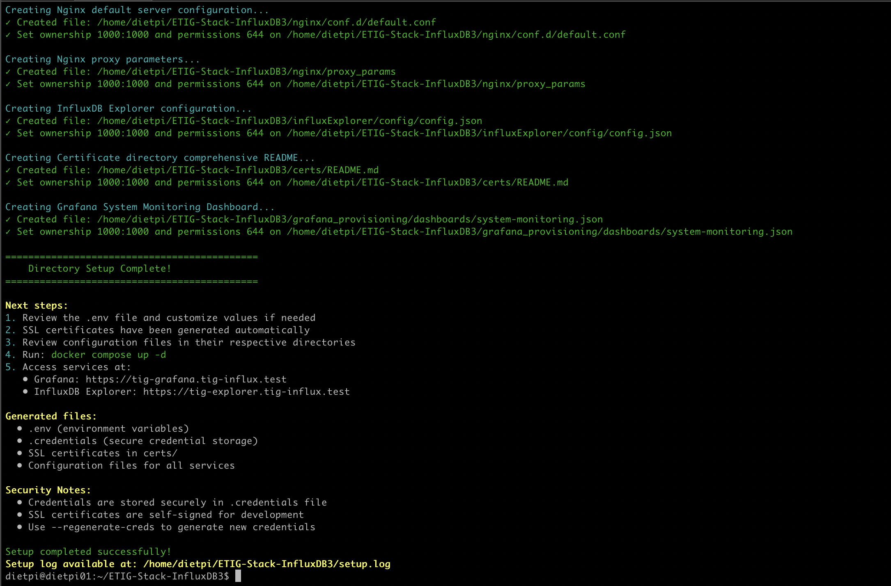
---

## Start the Stack

Launch all services in the background:

```bash
docker compose up -d
```

Docker will download the images and start:

- InfluxDB 3 Core  
- Grafana  
- Telegraf  
- InfluxDB Explorer  
- Alpine (to run init scripts)
- NGINX reverse proxy  

Monitor startup logs:
```bash
docker compose logs -f
```
Show all running containers:
```bash
docker ps --format "table {{.ID}}\t{{.Names}}\t{{.Status}}\t{{.Ports}}"
```

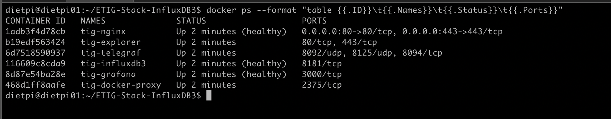

---

## Access the Portals

Once running, open your browser and navigate to:

| Service | URL |
|----------|-----|
| Grafana | `https://tig-grafana.tig-influx.test` |
| InfluxDB Explorer | `https://tig-explorer.tig-influx.test` |

If you’re running locally without DNS, add an entry in `/etc/hosts`, for example:
Or modify your internal DNS server and add the records pointing the tig-grafana.tig-influx.test and tig-explorer.tig-influx.test to the Docker Host Ip-Address.
This would be the prefered way.
```
127.0.0.1 tig-influx.test
```
Obviously you will get a certificate error when connecting because we use a self-signed certificate. 
And remember that you can find the Grafana password in the .credentials file!!

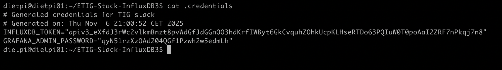

Access The Grafana Portal: 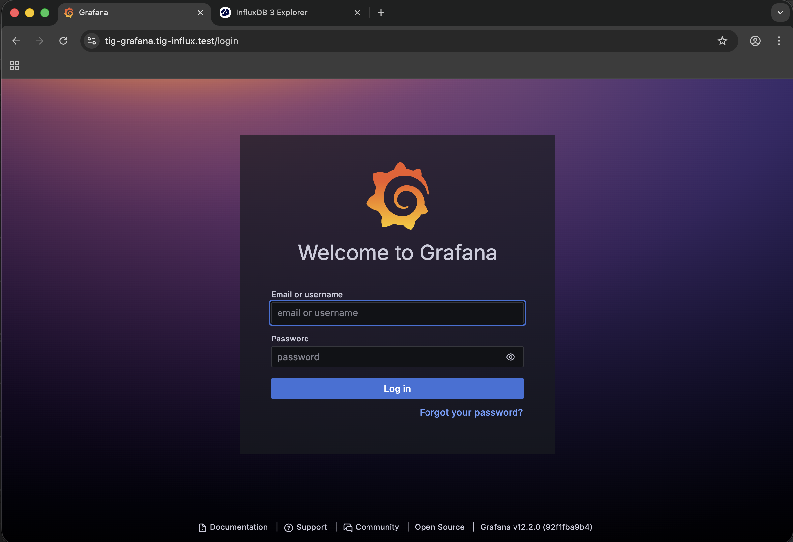  
Access Influx Explorer Portal: 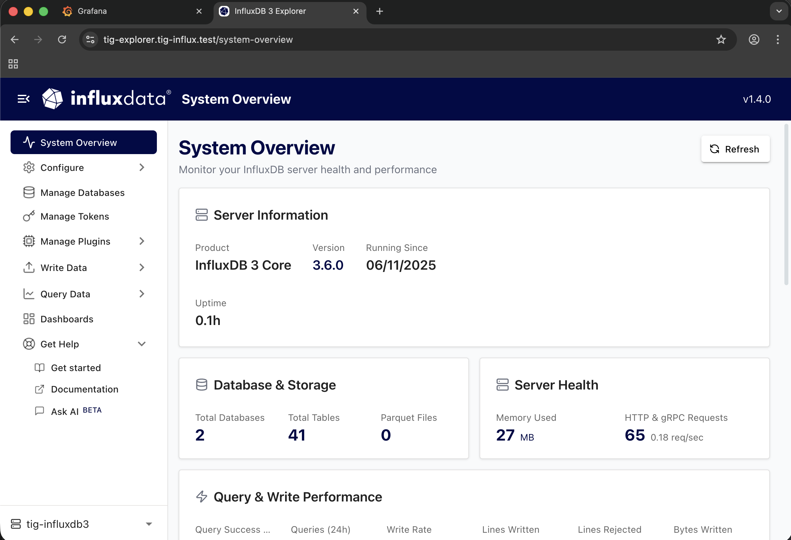

---

## Explore the Components

### **InfluxDB 3 Core**
A modern, high-performance time-series database for ingesting and querying metrics, sensor, and IoT data.  
Stored data is accessible via SQL, InfluxQL, or Flux.
In the setup script we created a database ```local_system``` and created a ```telegraf.conf``` that sends system data to the database.  

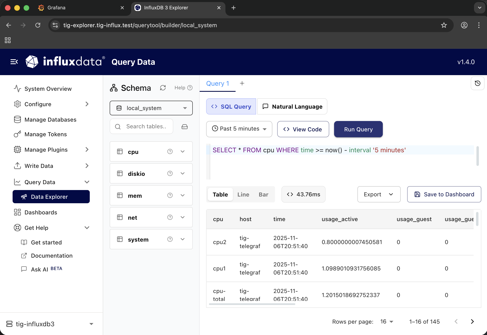

### **Telegraf**
Lightweight metrics agent preconfigured to collect system and container metrics.  
You can extend it by editing the Telegraf configuration under `./telegraf/config/`.

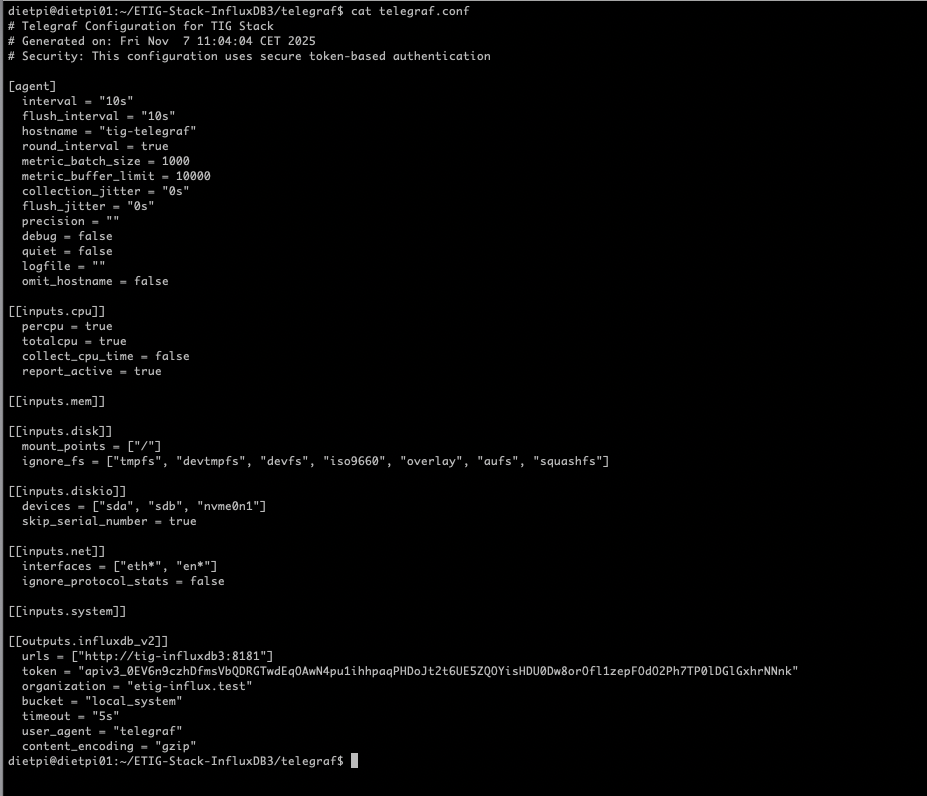

### **Grafana**
Pre-provisioned with:
- Data source: InfluxDB 3
- Example dashboard with visualization from telegraf data
- A preconfigured Grafana Service Account and Grafana Token (listed in ```.credentials```)
Dashboards are stored under `grafana_provisioning/dashboards/`.

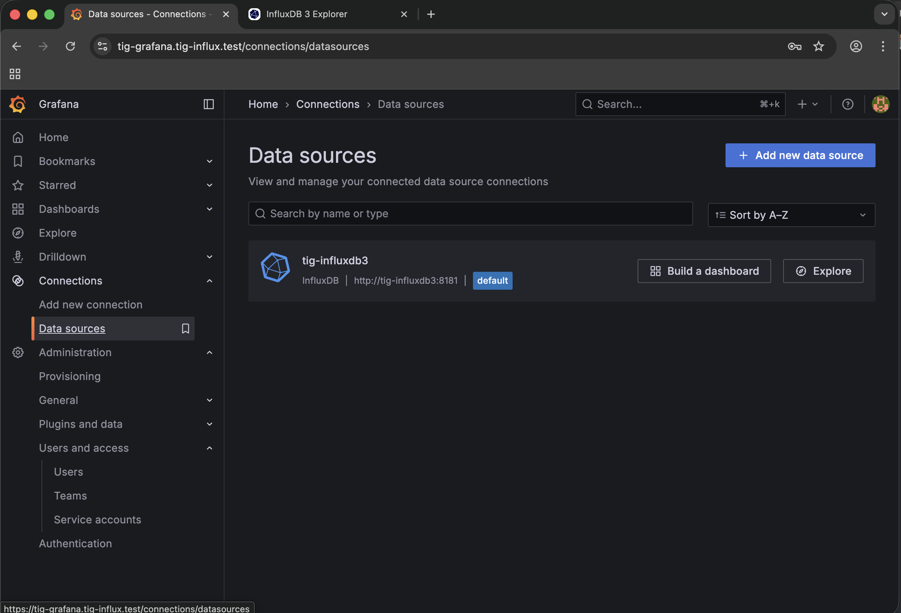
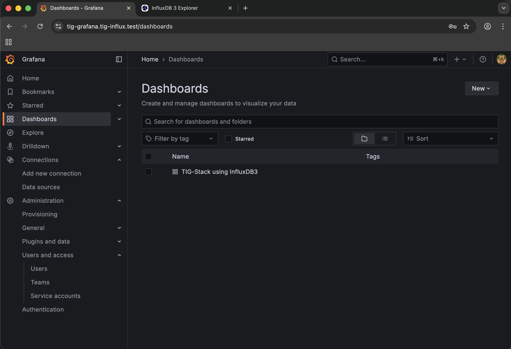
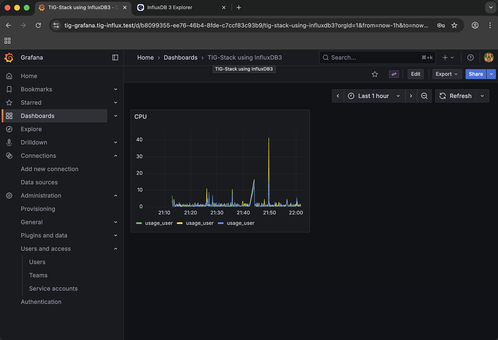
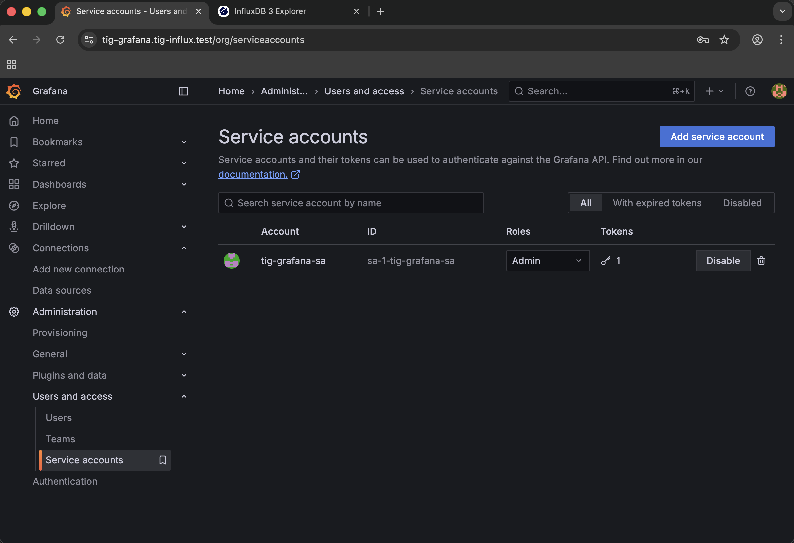
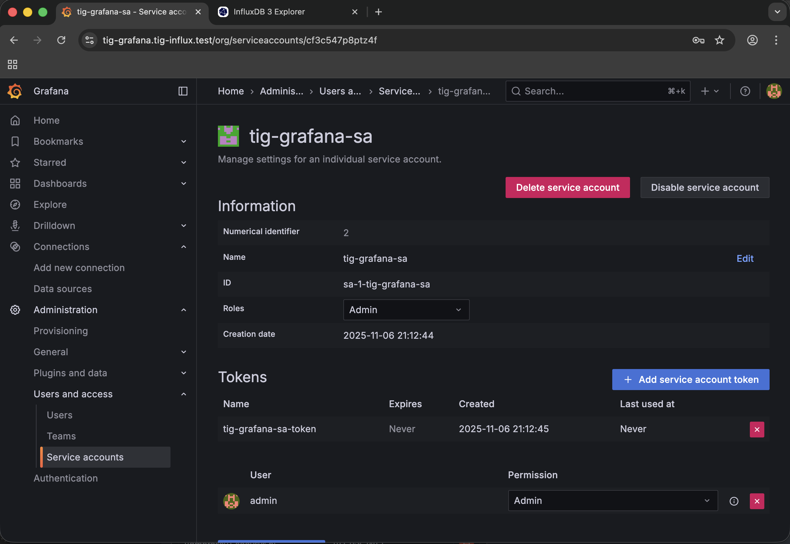

### **InfluxDB Explorer**
A graphical interface to browse, query, and inspect data stored in InfluxDB 3.

### **Alpine - Scripts Init**
A container `tig-scripts-init` (runs once, auto-removes on completion) that runs scripts when target containers are running and healthy 
### - wrapper.sh
Main orchestration script that executes initialization tasks in sequence:
- Runs `create-database.sh` to initialize the InfluxDB database
- Runs `grafana-token.sh` to set up Grafana authentication
### - create-database.sh
Automated InfluxDB database creation script that:
- Installs required tools (curl, jq) in the Alpine container
- Extracts authentication token from `/etc/influxdb3/auto-admin-token.json`
- Waits for InfluxDB to become healthy (configurable timeout)
- Creates the initial database `local_system` (configured via `INFLUXDB_BUCKET`)
- Handles error cases (already exists, authentication failures, etc.)
- Provides detailed logging of the creation process

### - grafana-token.sh
Grafana Service Account and API token creation script that:
- Installs required tools if not already installed (curl, jq)
- Waits for Grafana to become healthy before proceeding
- Tests authentication with admin credentials
- Creates a Grafana Service Account with Admin role
- Generates an API token for the service account
- Stores the token in .credentials
- Exports `GRAFANA_API_TOKEN` environment variable for subsequent use

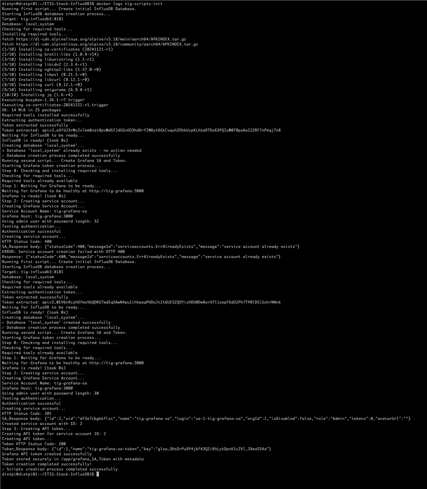

### **NGINX**
Acts as a reverse proxy in front of Grafana and InfluxDB Explorer, managing HTTPS and path routing.

---

## Customization
Remember that you have a dual approach to modify, adjust, add or delete functionality into this stack. 
Just learn and familiar yourself with the way the ```dev-setup-etig.sh```script works. Add your new dashboards, data sources, nginx stuff, etc. in the script.
Or . . . adjust the environment in the environment:
- To add your own dashboards, place JSON files into  
  `grafana_provisioning/dashboards/`
- To add additional data sources, edit  
  `grafana_provisioning/datasources/`
- To regenerate credentials or certificates, rerun:  
  ```bash
  ./dev-setup-etig.sh --regenerate-creds
  ```

---

## Production Considerations

For production or shared environments:

1. Replace self-signed certs with valid CA-issued certificates.
2. Set stronger passwords and secrets.
3. Configure persistent storage volumes and do regular backups.
4. Limit external access to ports using firewalls or VPN.
5. Enable automatic container restarts (`restart: unless-stopped` in compose).

---

## Troubleshooting

| Issue | Possible Cause | Solution |
|--------|----------------|-----------|
| `502 Bad Gateway` | NGINX couldn’t reach backend | Check if Grafana/Explorer containers are running |
| SSL warning in browser | Self-signed certificate | Use trusted CA or import cert manually |
| Grafana login fails | Incorrect creds | Check generated `.env` file and restart |
| No data in dashboards | Telegraf not collecting | Check Telegraf logs via `docker logs tig-telegraf` |

Useful commands:
```bash
docker compose ps
docker compose logs <service>
docker ps -a --format "table {{.ID}}\t{{.Names}}\t{{.Ports}}"
docker image ls
docker exec -it <container> bash
```

---

## Directory Structure

```
ETIG-Stack-InfluxDB3/
├── dev-setup-etig.sh         # Setup script
├── .env                      # Environment variables 
├── .credentials              # Secure credentials 
├── certs/                    # TLD Certificates 
├── docker-compose.yml        # Docker Compose file 
├── grafana_config/           # Grafana configuration
│   └── grafana.ini           # Custom grafana.ini
├── grafana_data/             # Persistent Grafana DB
├── grafana_provisioning/     # Auto-provisioned 
│   ├── dashboards/
│   │   ├── dashboards.yml    # Load dashboards from
│   │   └── my-dashboard.json # Dashboards 
│   └── datasources/
│       └── datasources.yml   # Datasource definitions
├── influxExplorer/           # Influx Explorer 
│   ├── config/
│   │   └── config.json       # InfluxDB3 Server con.
│   └──  db/
│       └── sqlite.db         # Influx Explorer db 
├── influxdb/                 # InfluxDB3 config files
│   └── config/               # Admin Token
├── influxdb_data/            # Persistant InfluxDB3 
│   ├── plugins/
│   │   └── .venv/            # Python virtual runtime
│   └── writer1/              # InfluxDB3 Databases 
├── nginx/                    # Nginx configuration
│    ├── nginx.conf
│    ├── tig-influx.test.crt
│    └── tig-influx.test.key
│    └── conf.d/
│       └── default.conf
├── scripts/                  # Initialization scripts
│    ├── wrapper.sh
│    └── create-database.sh
│    └── grafana-token.sh
└── telegraf/                 # Telegraf configuration
     └── telegraf.conf
```

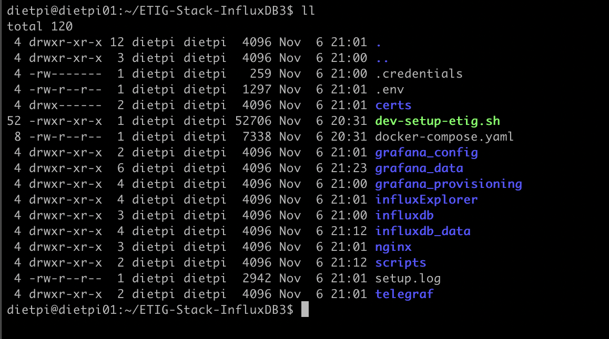

---

## Credits and License

This project was inspired by  
**[Suyash Joshi’s TIG-Stack using InfluxDB 3](https://github.com/InfluxCommunity/TIG-Stack-using-InfluxDB-3)**  
from the Influx Community.

Developed and maintained by **Edward Voermans**.  
Licensed under the [MIT License](LICENSE).

---

*If this project saves you time or helps you prototype faster, please ⭐ star the repo or open an issue/PR — contributions and feedback are always welcome!*

And, by the way, if you are looking for the automated **Kubernetes K3S version** I created check this: https://tinyurl.com/3889hkvr 
